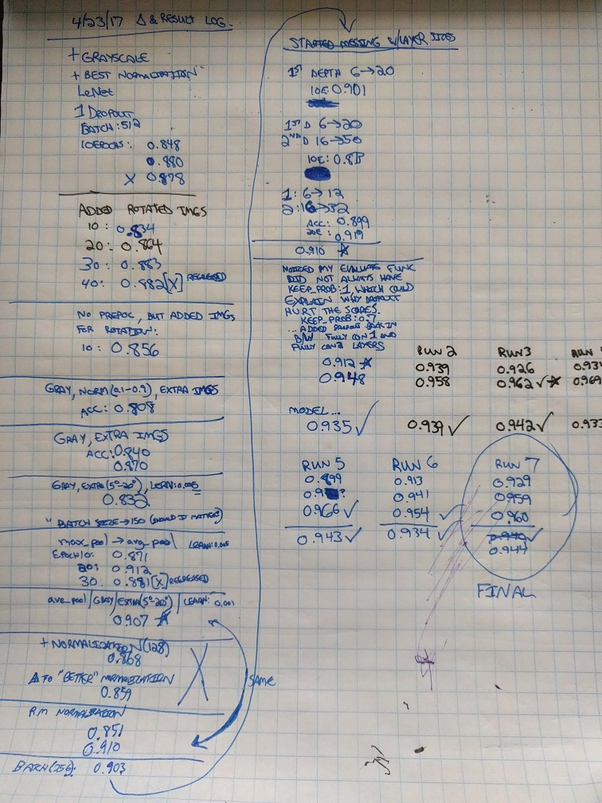

# **Traffic Sign Recognition** 

**Build a Traffic Sign Recognition Project**

The goals / steps of this project are the following:
* Load the data set (see below for links to the project data set)
* Explore, summarize and visualize the data set
* Design, train and test a model architecture
* Use the model to make predictions on new images
* Analyze the softmax probabilities of the new images
* Summarize the results with a written report

[//]: # (Image References)

[histogram_1]: ./writeup_images/visualization.png "Visualization - Histogram of images per class"
[histogram_2]: ./writeup_images/visualization_moredata.png "Histogram of images per class after adding additional data (via rotating other data)"
[logs_1]: ./writeup_images/logs_page1.jpg "Logs - Page 1"
[logs_2]: ./writeup_images/logs_page2.jpg "Logs - Page 2"
[children_crossing]: ./web_signs/children_crossing.jpg "Children Crossing"
[no_entry]: ./web_signs/no_entry.jpg "No Entry"
[no_truck_passing]: ./web_signs/no_truck_passing.jpg "No Passing by Trucks"
[right_turn]: ./web_signs/right_turn.jpg "Right Turn Ahead"
[stop]: ./web_signs/stop.jpg "Stop"
[network_visualization]: ./writeup_images/network_visualization.png "Feature Map Visualization"

## Rubric Points
### Here I will consider the [rubric points](https://review.udacity.com/#!/rubrics/481/view) individually and describe how I addressed each point in my implementation.  

---
### Writeup / README

#### 1. Provide a Writeup / README that includes all the rubric points and how you addressed each one. You can submit your writeup as markdown or pdf. You can use this template as a guide for writing the report. The submission includes the project code.

You're reading it! and here is a link to my [project code](https://github.com/udacity/CarND-Traffic-Sign-Classifier-Project/blob/master/Traffic_Sign_Classifier.ipynb)

### Data Set Summary & Exploration

#### 1. Provide a basic summary of the data set. In the code, the analysis should be done using python, numpy and/or pandas methods rather than hardcoding results manually.

In the Jupyter notebook I calculated the size of the dataset
* The size of training set is 34799 images
* The size of the validation set is 4410 images
* The size of test set is 12630 images
* The shape of a traffic sign image is 32x32x3 (the pickle file is scaled down from their original size, and there is a depth of 3 because of the 3 color channels in the image)
* The number of unique classes/labels in the data set is 43

#### 2. Include an exploratory visualization of the dataset.

Here is an exploratory visualization of the data set. It is a bar chart showing how many images were provided of each class type.

Looking at this histogram, it can be seen that a large number of classes have WAY less than the mean number of images and from testing we verified that this was leading to poor results on those classes as one would expect.

![original data histogram][histogram_1]

(see the next section for how I addressed this challenge)

### Design and Test a Model Architecture

#### 1. Describe how you preprocessed the image data. What techniques were chosen and why did you choose these techniques? Consider including images showing the output of each preprocessing technique. Pre-processing refers to techniques such as converting to grayscale, normalization, etc. (OPTIONAL: As described in the "Stand Out Suggestions" part of the rubric, if you generated additional data for training, describe why you decided to generate additional data, how you generated the data, and provide example images of the additional data. Then describe the characteristics of the augmented training set like number of images in the set, number of images for each class, etc.)

To first address the "Stand Out Suggestions", the prior histogram revealed that the training data was very un-even and many classes had an insufficient amount of images.

To solve this problem, I created a minimum number of images (originally I used the mean which is around 750, but experimentation found that 500 works at least as well) and then generated images to fill out all of the undersized classes.  The extra images were created by repeatedly selecting a random image from the input data-set, then rotating it by +/- 5-degrees to 20-degrees (the angle and the sign were chosen randomly). I had also exprimented with angles between +/- 10 and 20 degrees, but lowering the boundary to 5 degrees seemed to increase accuracy slightly.

| ![original data histogram][histogram_1] | ![histogram of classes after adding additional images][histogram_2] |
|:---:|:---:|
| Initial dataset | After adding rotated images |

This made the data much more helpful on many classes. Since the additional data was based off of slight transforms of a very small amount of input-data, these classes will still be less robust than if they had real data, but this is a fairly effect stop-gap that can be a great alternative when it is not practical to collect additional data for training.

**Additional Preprocessing**

I tried several preprocessing methods and analyzed their effect to decide on whether to keep them.

**Grayscale** - Color is slightly useful for road signs when humans are interpreting them, but experimentally grayscaling the images consistently resulted in higher accuracy for the network.  This implies to me that the color (given the junkiness of original images) was actually serving to confuse the network more than help.  My hypothesis is that we're feeding raw pixel numbers to the CNN, whereas a human brain would itself be pre-processing and classifying the colors. If we see a red street-sign, regardless of the angle, the lighting conditions or a slight amount of fading due to age, we're going to see "red". Our input data could be seeing (255, 0, 0) vs (200, 100, 150) though. If we thought that color was extremely important, we could pre-process the input colors to "snap" the data to match a pallet of actual colors used in German street signs.

Grayscale cuts the image data in one-third (one channel instead of 3) so it should increase performance as well.

**Adaptive Histogram Equalization** - This adds contrast to the images. It was extremely time-prohibitive though and was more expensive than training the entire network. One workaround for this would have been to do this preprocessing once, then write all of the derived images out to a separate Pickle file and then load that on future runs. This would have been a bunch of work though, given that we were already at our target accuracy by the time this issue came up, I did not pursue this path further.

**Normalization** - This was one of the first things I tried, and I tried several types of normalization. I used the (data-128)/128 trick mentioned in the notebook, used normalization based on the actual mean and sum (these normalize from -1.0 to 1.0), and even normalized inside of a nice 0.1 to 0.9 box (which would prevent very high and very low values from being washed away or overpowered, and shockingly none of the normalizations resulted in accuracy improvements for me.

This is not consistent with what I would have expected, so I did some debugging to print out the raw pixel values before and after normalization and they DID appear in the ranges that I would have expected from normalization.  When I switched my normalization function to just be a NO-OP, accuracy was always the best.  This is a bit surprising for me and is one of the things I would return to investigate further if I ever needed to increase accuracy even more.

#### 2. Describe what your final model architecture looks like including model type, layers, layer sizes, connectivity, etc.) Consider including a diagram and/or table describing the final model.

The model was started as a LeNet architecture (since that is known to be good at classifying images) and then tweaked in a few spots.

I found that replacing Max-Pooling with Avg-Pooling had great results. It was one of the most significant changes in the entire project. It brought accuracy from around 0.84 to around 0.90 immediately!

Since there are more features to a class of 43 streetsigns than there are in the 0-10 digits that we initially wrote our LeNet for, I also experimented with increasing the sizes of the 2 convolutional layers since those layers represent features.  I increased the values approximately proportionally to the difference in the number of total output-classes between digits and our set of German traffic signs. Further tuning was done by just testing the results and finding what sizes performed well in the first 10 epochs of training.

The convolutional layers had a depth of 16 and 32 respectively, instead of 6 and 16.

After various changes were able to get the accuracy pretty high, I then added Dropout in the two gaps between the three fully-connected layers to prevent overfitting.  Any time I experimented with dropout before we had high accuracy, it actually decreased the accuracy (because we were still underfitting at that point, and dropout moves the model more towards underfitting).  The addition of dropout seems to have allowed my network to continue to make gains when running to 20 or 30 epochs.

My final model consisted of the following layers:

| Layer         		|     Description	        					| 
|:---------------------:|:---------------------------------------------:| 
| Input         		| 32x32x1 grayscale image   							| 
| Convolution 5x5     	| 1x1 stride, valid padding, outputs 28x28x16 	|
| RELU					|												|
| Avg pooling	      	| 2x2 stride, valid padding outputs 14x14x16 				|
| Convolution 5x5	    | 1x1 stride, valid padding, outputs 10x10x32 	|
| RELU					|												|
| Avg pooling	      	| 2x2 stride, valid padding outputs 5x5x32 				|
| Flattening					|	So that we can send the data into fully-connected layers. output is flat 800			|
| Fully connected		| Fully connected layer. Input 800, output 120					|
| RELU					|												|
| Dropout					|	To prevent overfitting Keep_prob 0.7 for training (always 1.0 for eval)	|
| Fully connected		| Fully connected layer. Input 120, output 84					|
| RELU					|												|
| Dropout					|	To prevent overfitting Keep_prob 0.7 for training (always 1.0 for eval)	|
| Fully connected		| Fully connected layer. Input 84, output number_of_classes (43 in this case)					|

#### 3. Describe how you trained your model. The discussion can include the type of optimizer, the batch size, number of epochs and any hyperparameters such as learning rate.

To train the model, I used the AdamOptimizer and had the loss operation reduce the mean of cross-entropy. This worked great in my prior LeNet lab so I kept it.

I experimented with various hyper-parameters:

**Learning Rate** Although 0.005 showed some promise, 0.001 seemed to be the optimal learning rate. Higher values would cause the model to flail

**Epochs** 10 Epochs was used for much of my testing (just due to time-constraints) but I created a cell that would allow me to re-load existing progress and add 10 more epochs to the same model. I noticed that once I had the dropout added, I was able to continue to train the model to 20 or 30 epochs and continue to see gains in accuracy.

In my final notebook, it would run the additional loop one time automatically (then I would typically run it one more time by hand) to end at **30 epochs**.  There was consisten improvement between 10 and 20 epochs. There was often an improvement between 20 and 30 epochs, but not always, and it wasn't very high.

**Keep Probability for Dropout** - running with a keep_prob of 0.5 was a bit too harsh for the model and would probably perform better if there had been more training data. Upping the keep probability to 0.7 resulted in much more stable accuracy.

**Batch size** - typically, increasing the batch size just makes your model train faster up until the point where you start running into memory issues and either crashing or swapping.  Using `top` on the AWS instance I was running, then extrapolating, I was able to see that a batch size of 512 could safely be handled without getting near the memory boundaries of the instance.  Interestingly, turning the batch-size down to 256 resulted in slightly better accuracy 

**SIDE-NOTE: Audio** - you may have noticed a small audio file at the bottom of the training sections. Training took around 200 seconds for every 10 epochs, which lead to a great deal of waste - I would go off to study another part of the code, then not be able to start my next batch of testing immediately because I would not know when the training had completed - so I made the code output and auto-play a sound-file immediately upon completion of training the network.  This allowed me to test a ton more iterations of my architecture much faster than normal (I shared the code in the CARND Slack, so hopefully you'll see other projects with this, as well).

For all of these hyperparameters, it was tricky to tune because the variance in accuracy between any two random runs was high enough to obscure any small improvements in performance (and since training takes so long, I couldn't just smooth out those errors by testing repeatedly).  To ensure that I didn't get lost, I kept a log (the columns run right-to-left on the first page, sorry) where I would make notes of what I changed, as well as the accuracy of the model after the changes (on the test set).  Only once I was satisfied with my training accuracy did I start also using the final test set.  The last batch of stats after "unlocking" the test data were all nearly identical code, I just had to run it several times while I was testing optional outputting of the feature map, so I figured I might as well record the results of each of those runs since they were relatively time-expensive. The results do show that the model consistently trains around 0.96 and peaked at around 0.97.  The final test set was consistently above 0.93 but the highest it got was 0.944.  The test set scoring slightly lower implies a little bit of overfitting to the training data.

Here are the logs (click for fullsize images):

#### 4. Describe the approach taken for finding a solution and getting the validation set accuracy to be at least 0.93. Include in the discussion the results on the training, validation and test sets and where in the code these were calculated. Your approach may have been an iterative process, in which case, outline the steps you took to get to the final solution and why you chose those steps. Perhaps your solution involved an already well known implementation or architecture. In this case, discuss why you think the architecture is suitable for the current problem.

As stated above, I started with a LeNet architecture because it is well-known to be a good solution to classifying images.  The use-case of 43 traffic signs should have been (and was) well within its abilities. The final results of getting 0.944 on the unseen test-data after training speaks volumes of the value of LeNet for this type of task.

My whole process can be followed from the logs whose thumbnails are above (click the thumbnails to see large images which are legible).

The top-level plan was to get a solid base, then add the laundry-list of tactics that we learned in the lessons in, one-at-a-time and measure their results. Due to some confusion caused by data-pollution in the Jupyter Notebook, the reality was slightly less linear, but it followed the same basic principle.

Basically my process consisted of:
1. Get it to run basic LeNet to completion without crashing
2. Thinking I had 0.945 accurracy and starting to experiment.
3. Spending a long time flailing at trying other methods to try to regain the 0.945 accuracy
4. Finally realizing that the very early 0.945 was some kind of fluke potentially related to weird data in the Jupyter notebook. My current hypothesis was that I did too much pre-processing to a point that my data became so battered that it was all basically the same (so my validation data was very similar near-blank images to the near-blank images I was training with).
5. Removing all tweaks and debugging the low-accuracy state until I found some bugs and got vanilla LeNet to perform decently. 0.7-0.8
6. Slowly doing experiments on each feature to determine if it made accuracy better or worse.
  1. Various types of normalization (oddly, having no normalization was the best)
  2. Grayscale preprocessing (grayscaling consistently improved accuracy)
  3. Dropout (when only using it in the fully-connected layers it seemed to have a slight benefit & prevented overfitting - a keep_prob of 0.7 did measurably better than 0.5)
  4. Adding rotated versions of images, to classes with a small number of training images (and testing various rotation angles)
  5. Tested various hyperparameters for Learning Rate (0.001 worked best) and Epoch size (and eventually came up with a solution that allows me to do 10 and add on sets of 10 more epochs at will - 20 to 30 Epochs seemed to work best once Dropout was in there).
  6. Max Pooling vs Avg Pooling (Avg was way better)
  7. Trying normalization again because I couldn't believe that it really hurt accuracy (it still hurt accuracy so I kept it out after this)
  8. Tweaked batch-sizes some more (256 had slightly better accuracy than 512, but this should be due to just random luck since batch size shouldn't affect accuracy, it mainly affects training).
  9. Experimented with layer sizes.  Larger convolutional layers made intuitive sense because there are more features in traffic signs than in digits from 1 to 10.  Took a good guess then increased up and down a bit to try to find a sweet-spot.
  10. With the system performing well above the required amount every time I retrained it, I decided to run it against the test-data and that also performed above the goal.

My final model results were:
* **validation set accuracy of 0.960**
* **test set accuracy of 0.944**

 

### Test a Model on New Images

#### 1. Choose five German traffic signs found on the web and provide them in the report. For each image, discuss what quality or qualities might be difficult to classify.

Here are five German traffic signs that I found on the web.  The story of how they were chosen is actually interesting.

I started with a google image search for "German Traffic Signs" and used the setting "Labeled for Non-Commercial Reuse" and of type "Photo" (because that's what we're really trying to do here... classifying vector-art with no background is probably easy and isn't very helpful to a self-driving car)... and then found that most of the results are for sign types that aren't even recognized in our dataset. If we were really to drive in Germany, we would need better training data!  Since most of the labeled-for-reuse signs were too easy (which makes sense... photographers like to take really clear, direct pictures of things), I decided to take a different approach to search the subsset of images which are known to be good test-cases for traffic sign classifiers...

To ensure I'd find images that made sense for our data, I googled "german traffic signs carnd" (carnd is the name of our program... so obviously the google results for this search should be flooded with suitable images for testing!) and found a github which had example images in it: https://github.com/netaz/carnd_traffic_sign_classifier ...I didn't look at his network's results, so I don't know if it's a particularly easy/hard set or not; but hopefully our networks are different enough that we'd still get potentially different results anyway.

![Children Crossing][children_crossing] ![No Entry][no_entry] ![No Truck Passing][no_truck_passing] 
![Right Turn][right_turn] ![Stop][stop]

The first image looks difficult because of the distortion. It's very unclear what angle this photo could have been taken from. Perhaps, slightly above and with a distorted lens? There also appears to be some color artifacts on the bottom.

The "no_entry" sign looks easy, the next three all look like good candidates that would be fun to see how the classifier could deal with them. The "stop" sign is a little washed out with glare near the top-right but it is a very distinctive sign that seems like it should still be easy (be sure to look at the actual results below for the real story).

NOTE: CURRENTLY THIS FAR IN THE WRITEUP... <---------------------------------------------------

#### 2. Discuss the model's predictions on these new traffic signs and compare the results to predicting on the test set. At a minimum, discuss what the predictions were, the accuracy on these new predictions, and compare the accuracy to the accuracy on the test set (OPTIONAL: Discuss the results in more detail as described in the "Stand Out Suggestions" part of the rubric).

One fascinating thing about running this model is that as I was working to get my output-feature-map code to run, I completely retrained my Neural Network several times and the accuracy actually changed.  The accuracy was usually 0.60 but I saw it hit 0.40 and 0.80 (the extra one it picked up was the stop-sign). Most of the time, it was 0.60 accuracy though.  The common results are below...

Here are the results of the prediction:

| Image			        |     Prediction	        					| 
|:---------------------:|:---------------------------------------------:| 
| Children Crossing      		| Road Work   									| 
| No entry     			| No entry 										|
| No passing for vehicles over 3.5 metric tons | No passing for vehicles over 3.5 metric tons	|
| Turn right ahead	      		| Turn right ahead					 				|
| Stop			| Speed limit (70km/h)     							|

The model was able to consistently correctly guess 3 (occasionally 4) of the 5 traffic signs, which gives an accuracy of 60% (occasionally 80%). This is reasonably parallel to the validation set when testing on such a small sample-set of 5 images.

#### 3. Describe how certain the model is when predicting on each of the five new images by looking at the softmax probabilities for each prediction. Provide the top 5 softmax probabilities for each image along with the sign type of each probability. (OPTIONAL: as described in the "Stand Out Suggestions" part of the rubric, visualizations can also be provided such as bar charts)

The code for showing softmax predictions on my final model is located in the 26th cell of the Ipython notebook.

The "Children Crossing" was always a struggle (probably due to the distortion and noise in the image).  As I saw repeatedly, when guessing incorrectly, the model was usually unsure of its answer.

Image 0 (sign is actually 'Children crossing'):
   [PROB]  - [SIGN]
   0.486304 - Road work
   0.275924 - Beware of ice/snow
   0.221523 - Right-of-way at the next intersection
   0.00726475 - Road narrows on the right
   0.0037681 - Children crossing

The next 3 images were all classfied correctly. It's interesting to notice how extremly high their confidence was. They were all at least 0.9997 certain. That's pretty certain!

Image 1 (sign is actually 'No entry'):
   [PROB]  - [SIGN]
   0.999989 - No entry
   1.05961e-05 - Stop
   8.40141e-09 - Turn left ahead
   3.39395e-10 - Yield
   8.76705e-11 - Keep left

Image 2 (sign is actually 'No passing for vehicles over 3.5 metric tons'):
   [PROB]  - [SIGN]
   1.0 - No passing for vehicles over 3.5 metric tons
   8.64994e-08 - No passing
   2.2182e-12 - Speed limit (80km/h)
   9.62741e-15 - Priority road
   7.56255e-15 - Ahead only

Image 3 (sign is actually 'Turn right ahead'):
   [PROB]  - [SIGN]
   0.999736 - Turn right ahead
   0.000197557 - Road work
   4.93255e-05 - Stop
   4.8891e-06 - Right-of-way at the next intersection
   4.86125e-06 - Vehicles over 3.5 metric tons prohibited

The most interesting result for me, was that the "Stop" sign changed a bunch.  It was sometimes predicted correctly; sometimes when I retrained the whole model, it was quite confident that the Stop sign was "No entry"; and on the final run, the model had no idea it was a stop sign and thought it was almost certainly a Speed Limit of some sort.  While it's fairly confident at 0.95, perhaps a confidence of 0.99+ is how we can know whether the classifier was having trouble figuring out a sign.

Again, this parallels human thought processes. If you see a washedout stop-sign that's reflecting a glare in your eyes, perhaps you've assumed it's a speed-sign, but you may keep looking longer because you're only 95% certain (which is about a 1/20 chance that you just might be running a stop-sign!). Fortunately, humans also have other metadata to go on (we expect to see a stop sign at an intersection, not a speed limit sign). But I digress! Here are the rather embarassing softmax values for the Stop sign:

Image 4 (sign is actually 'Stop'):
   [PROB]  - [SIGN]
   0.953781 - Speed limit (70km/h)
   0.0449219 - Speed limit (30km/h)
   0.000849137 - Speed limit (20km/h)
   0.00026818 - No vehicles
   0.00013589 - Speed limit (50km/h)

### (Optional) Visualizing the Neural Network (See Step 4 of the Ipython notebook for more details)

#### 1. Discuss the visual output of your trained network's feature maps. What characteristics did the neural network use to make classifications?

I used the provided code to visualize the 2nd convolutional layer of the network after full training, when it was trying to classify the "No Entry" image. What this does is show what features it finds to be important in general and particularly in the No Entry image. As we can see, there are a lot of prominent horizontal bars, and many of the features show that they are concerned with the general shape of the sign. You can clearly distinguish rounded sign edges showing up in many FeatureMaps, but it is particularly pronounced in 0, 23, and 31.

One thing to keep in mind is that this is rendering a grayscale of weights at the 2nd convolutional layer and higher weights mean that a feature has more impact on classifying the item. Since higher weights correspond to higher pixel values (black is 0, white is 255) then the more WHITE is seen, the more important that feature is.  So whatever Feature 28 is, it doesn't appear prominently in the No Entry sign, whereas something like Feature 20 might be a feature for the solid white bar that actually appears in the image (even if the sign was always a solid black bar, it would be white in the feature-map).

![Feature Map Visualization][network_visualization]

Since the "hidden layer"s of a Convolutional Neural Network are often a black-box, it was great to be able to visualize the features in a layer. It could be a fun experiment to feed other images into the same visualization and see what they notice.
